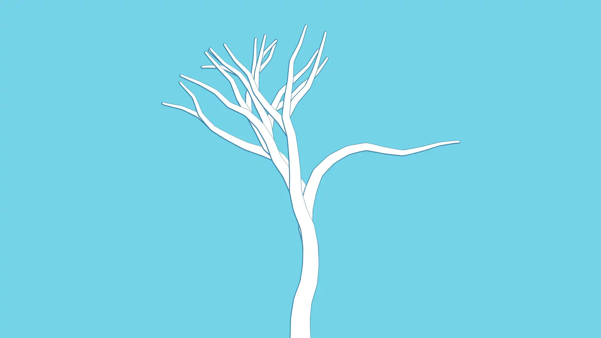

# Seasonal Tree

> Generative Art: Art that has been created with the use of an autonomous system. This differs in philosophy and approach from generative AI.

This is a companion to the system I use to theme my desktop across programs and toolkits, [themes](https://github.com/frigorific44/themes). It is run daily, not just with seasonally interpolated colors, but also with parameters that themselves change from season to season, giving generated trees different characters throughout the year. Parameters can be given through the command-line, or through a TOML configuration file.

## Usage

The project is built entirely in Rust, so clone the repository and build from source as normal:

```
git clone https://github.com/frigorific44/seasonal-tree.git
cd seasonal-tree
cargo build --release
./target/release/seasonal-tree --help
```

Configuration with a TOML file can be specified with the `-c/--config` argument. The file [example.toml](example.toml) is available, and additional configuration reflects the command-line arguments and naming.
